## An Emotion Analyzer Tool Powered by Microsoft Azure

Deciding whether a photo is good enough to post, use as a profile picture, or display in any other way is arguably one of life's greatest challenges. As such, when deciding this, people will often seek advice from their friends. But even then, it's possible you might still have doubts about their feedback. Even if they tell you that you do in fact look your age and you do look absolutely ecstatic in that photo, who knows if they're telling you the truth? Instead of having to ask around until you're confident that they're telling the truth or at least, confident that you have many kind friends who will hype you up no matter what, you can use this handy-dandy tool to give you objective analysis on your photo. 

In this tutorial, you'll learn how to create a Google Extension that will allow you to upload photos to receive back a general summary of the face in your photo, including the person-in-photo's estimated age, gender, and smile intensity.

**Prerequisites:**

To start, make sure you have the following: 

- [A Microsoft Azure subscription:](https://azure.microsoft.com/en-us/free/)  Our project will feature several apps and resources from Microsoft Azure, so you'll need to create a Microsoft account and sign up for a subscription. When you sign up now and provide verification, you can get a free subscription for 12 months with a $200 credit! (Don't worry, you won't need to spend money for this project)
- [Visual Studio 2019:](https://visualstudio.microsoft.com/downloads/)   We'll use Visual Studio to edit and write the code the Chrome extension. You can use the Community version for free. This also makes it super convenient to use along with GitHub. 
- [Google Chrome:](https://www.google.com/chrome/) Unfortunately, Internet Explorer just won't cut it `:(`.  As for Safari and Firefox, both browsers require rather complicated processes to use Chrome extensions, so I'd recommend using Chrome. Within Chrome, make sure you have a Google account so you can add extensions to your browser. 

Once you have all those components, we can get into the coding! This project has 3 main components that we'll go through step by step: 

1. Image Uploading Website
2. Blob-trigger Logic App
3. Google Chrome Extension

**PART 1: Image Uploading Website**

The first part of the project is creating the web app that allows users to upload photos to the cloud. This bit is actually taken from https://docs.microsoft.com/en-us/azure/storage/blobs/storage-upload-process-images?tabs=dotnet, so if you have any confusion during those steps, you can refer to that tutorial for clarifications. To create the web app:  

1. Go to [portal.azure.com](portal.azure.com). Log in to your account if you haven't already. Once you are at the home page, click the button near the top right that looks like a box with `>_` in it. This will open Azure Cloud Shell, an environment where you can type commands to create resources and deploy apps.  

   

2. Once you click the button, a black window should open up at the bottom of the page. Select Bash instead of Power Shell for the environment. At this point, your screen should look like this. 

   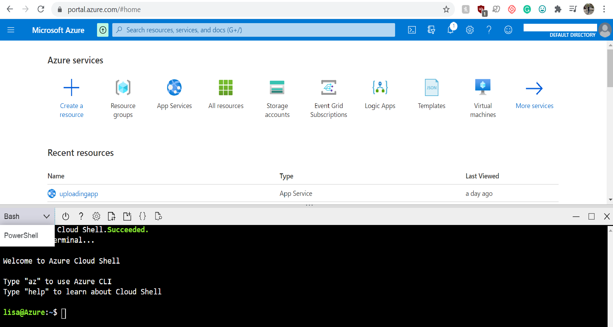

3. Once you're in the terminal, the rest of the steps involve you copying code and entering those commands into the Cloud Shell. These lines of code will create Resource Groups, containers, and deploy web apps for you. All the names of these different types of resources are totally up to you! I put in default names that are recognizable in all caps, but you can choose any name you want. In the first bit, you can change the name from `MYRESOURCEGROUP` to anything you want. It's up to you `:)`!  Just make sure that you keep this consistent with all the other code commands. For example, if you name this resource group `GodsResourceGroup` you must refer to the resource group as `GodsResourceGroup` in all other code commands. To start off, create a resource group by copying this line of code and entering: 

   `az group create --name MYRESOURCEGROUP --location southeastasia`

   You will know it will have worked if you receive back a message that looks like this:

   

   The "provisioningState" should have the status of "Succeeded". 

4. Create a storage account by copying and entering this code. Make sure this name is unique, otherwise the name might be taken.

   `az storage account create --name MYSTORAGEACCOUNT --location southeastasia \
     --resource-group MYRESOURCEGROUP --sku Standard_LRS --kind StorageV2 --access-tier hot`

   Remember to change the name of the resource group above to the name you chose previously! When I was following the original tutorial, I commonly would get errors back because I forgot to keep the names consistent.

5. Next, make some storage containers inside this storage account by copying some more code. You could change the name of images and thumbnails to something else, but personally just for clarification purposes, I wouldn't do that. You need to have functional names here just so you don't get confused for later steps.

   `blobStorageAccountKey=$(az storage account keys list -g MYRESOURCEGROUP \`
     `-n MYSTORAGEACCOUNT --query "[0].value" --output tsv)`

   `az storage container create --name images \`
     `--account-name MYSTORAGEACCOUNT \`
     `--account-key $blobStorageAccountKey`

   `az storage container create --name thumbnails \`
     `--account-name MYSTORAGEACCOUNT \`
     `--account-key $blobStorageAccountKey --public-access container`

6. Great! Now, make an app service plan by (you'll never guess ;D) *copying some more code*.

   `az appservice plan create --name MYAPPSERVICEPLAN --resource-group MYRESOURCEGROUP --sku Free`

7. Once that's done, we can now create a web app within the app service plan. Ctrl+C and Ctrl+V. Pick a unique name for the web app! Choose wisely, this name will determine the URL of the website to upload images at. 

   `az webapp create --name WEBAPP --resource-group MYRESOURCEGROUP --plan MYAPPSERVICEPLAN`

8. FANTASTIC! Truly. Really. I mean it. Noooow, for lucky step #8, we can deploy the actual web app. Copy time! 

   `az webapp deployment source config --name WEBAPP --resource-group MYRESOURCEGROUP \
     --branch master --manual-integration \
     --repo-url https://github.com/lisajl/azure-sdk-for-js-storage-blob-stream-nodejs`

9. Just 2 more steps! Almost there. Once we have the app deployed, we need to configure some settings via our fave method. At the bottom where it says

   `az webapp config appsettings set --name WEBAPP --resource-group MYRESOURCEGROUP \
     --settings AzureStorageConfig__AccountName=MYSTORAGEACCOUNT \
       AzureStorageConfig__ImageContainer=images \
       AzureStorageConfig__ThumbnailContainer=thumbnails \
       AzureStorageConfig__AccountKey=$blobStorageAccountKey`

10. That's all the copying and pasting for now! To make sure it all worked, visit your website and see if you can upload a photo. To do that, just go to WEBAPP.azurewebsites.net, but replace WEBAPP with whichever name you chose for the Web App. Here's what mine looks like:

    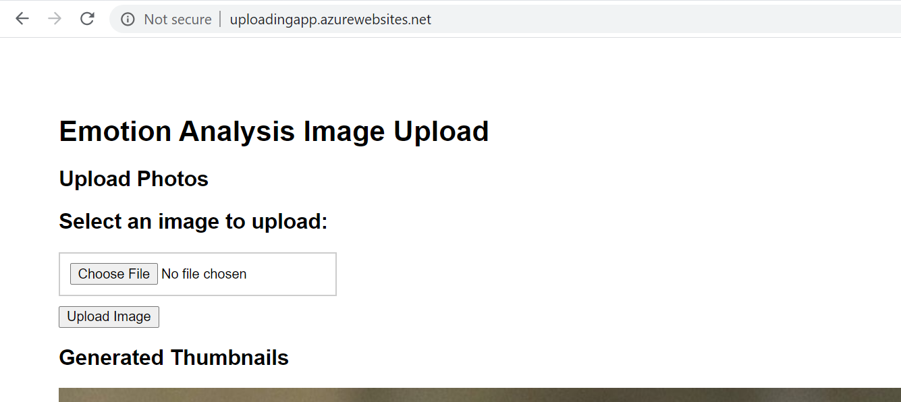

11. If you can see that page, try and upload an image. Then, refresh your Azure portal page, and go to your storage container labeled images. You should see the image! If you can see the image, great job! We can move on.

**PART 2: Blob-Trigger Logic App**

Now that you've created a website where you can upload photos and they'll be placed into a specific storage container, you now want to make a function that will be triggered when a new photo is uploaded to the container. 

1. Start by creating a logic app. At the home page for the Microsoft Azure Portal, press `+` to create a new resource. 

   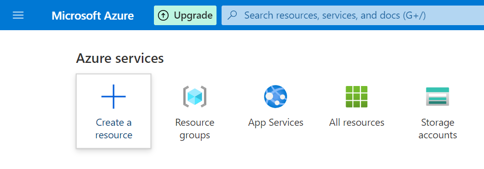

   Search for "logic app." Click on the first result and click `create`. 

   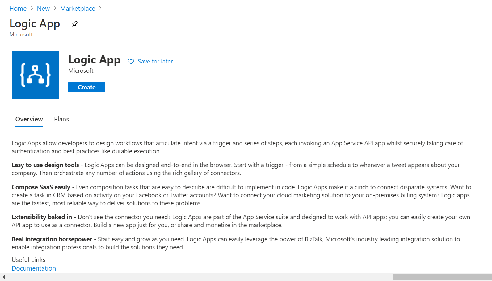

2. Configure the details of the Logic App. Make sure you choose the same resource group as the one from Part 1, and choose any name for the Logic App. Press `Review+Create` when you're done and then finally press `Create` after that.

   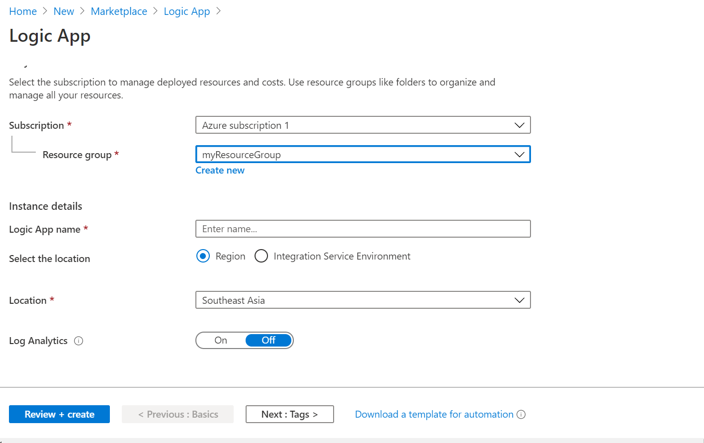

   Once created, it should tell you that the Logic App is being deployed. Eventually, it should tell you that the Logic App has been successfully deployed too. 

3. Next, we need to make a Face API resource. Click the `+` again, but this time search for Face. Click the first result, create, and follow the same process as before. (Make sure it goes to the same Resource Group, using same subscription, choose name, etc.) 

   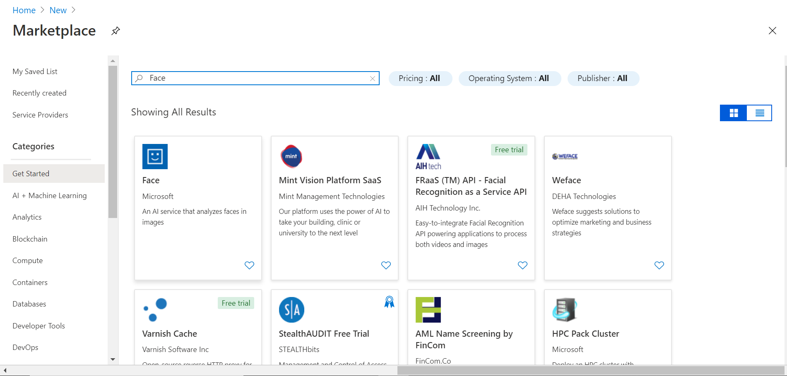

4. Once the Face API is deployed, click `go to resource`.  This should take you to a page with a menu of lots of options. Click Keys and Endpoints. Within that there should be a page with Key 1 and Key 2. In an external document or note, anywhere on your PC, really, copy Key 1. Keep this secret and have it on hand, we'll need it for later steps! Also copy the endpoint and put that in the notes, which is displayed below the keys.

   

5. Return to the Logic App you made. While you can copy and paste the code from the GitHub into Logic Apps, it will be much easier to simply create the Logic App through the Designer yourself, instead of having to change all the information so it works with your apps. So, go to Logic App designer in the left hand menu. Once there, press the `+` button to add a trigger. 

   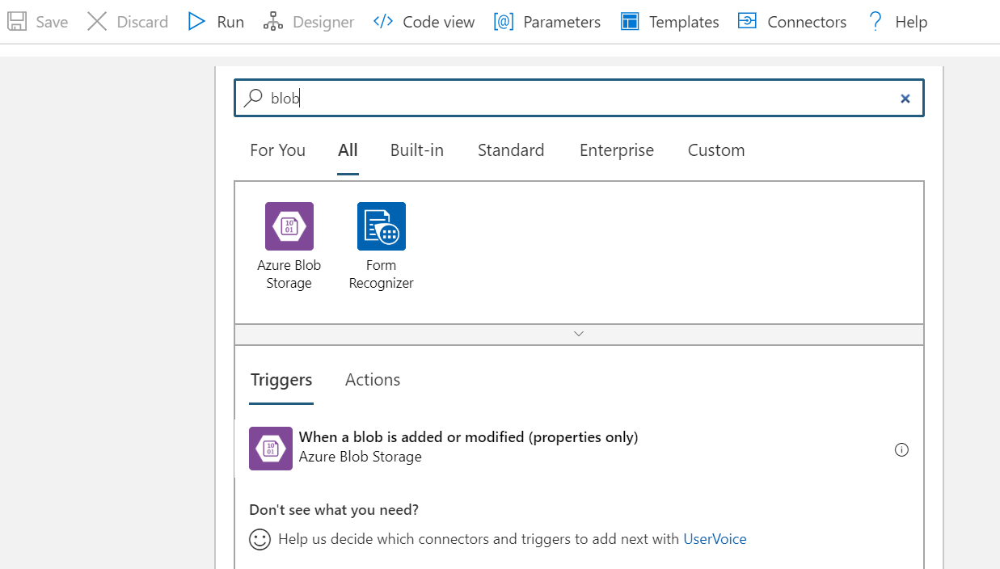

   Choose When a blob is added or modified, as seen above. Configure the trigger so that the logic app runs when 1 blob is added to the `images` container and have the trigger check every 10 seconds.

   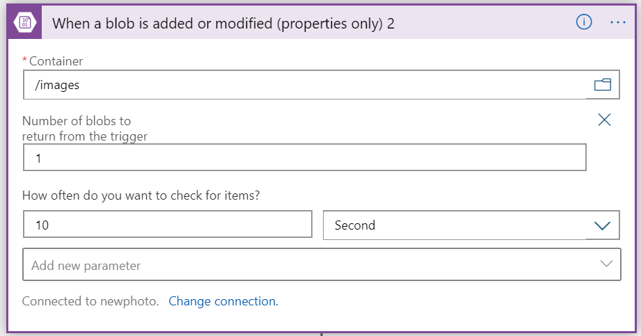

   If done successfully, it should look like this once the trigger is finished.

6. For the 2nd step in the Logic App, we need to connect the Face API. While previously for the trigger you basically just had to name the connection, this will require the entering of the API key from before. Once you copy and paste the key, you should create a connection for the step. From there, simply paste the image URL (composed of the website url + `List of Files Name` )

   

   The `List of Files Name` will be considered Dynamic Content, and will show up as a dropdown menu available when entering in the URL.

7. Before we move on to the last step in making the Logic App, we must first make a third storage container in the original storage account. Go back to the storage account, click containers, and now create a third storage container, this time with the name "data" and the access level as container. 

   

8. Now, the last step for the Logic App is to make an action that responds to each `body` that the Face API detects. For each `body` ,  choose the action to have a blob created with information about the image to be sent to the data container. 

   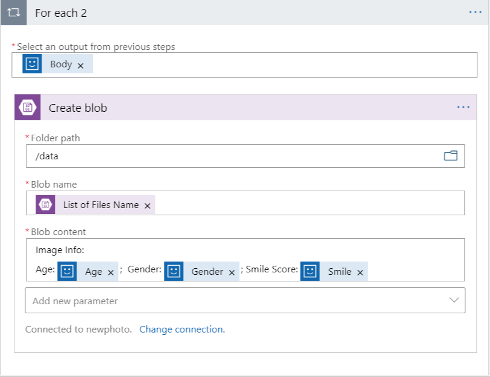

   Make sure the blob name is `List of Files Name`. This will be important to easily locate the data you got from the Face API! 

At this point, if you followed everything correctly, you will now have a working Logic App that lets the Face API analyze the image uploaded and respond by giving back data about the image. To test it, press `Run` and then upload an image to the website you created. You should receive a check for each of the steps. Finally, go to the data storage container and make sure a blob was created with the right information. If it's there, great job!! We can move on to the last and final part of this project.

**PART 3: Google Chrome Extension**

Finally! I promise you though, this will be the shortest part in this project tutorial. We'll be using Visual Studio to create a Google Chrome extension. 

1. Go to [chrome://extensions](chrome://extensions) in Google Chrome (duh). From there, turn on developer mode in the corner. This should turn the button from gray to blue.

      This is what it should look like on. It is, in fact, blue. 

2. Next, go to the GitHub page above and download the Emotion Extension folder to your desktop. Open it in Visual Studio. 

   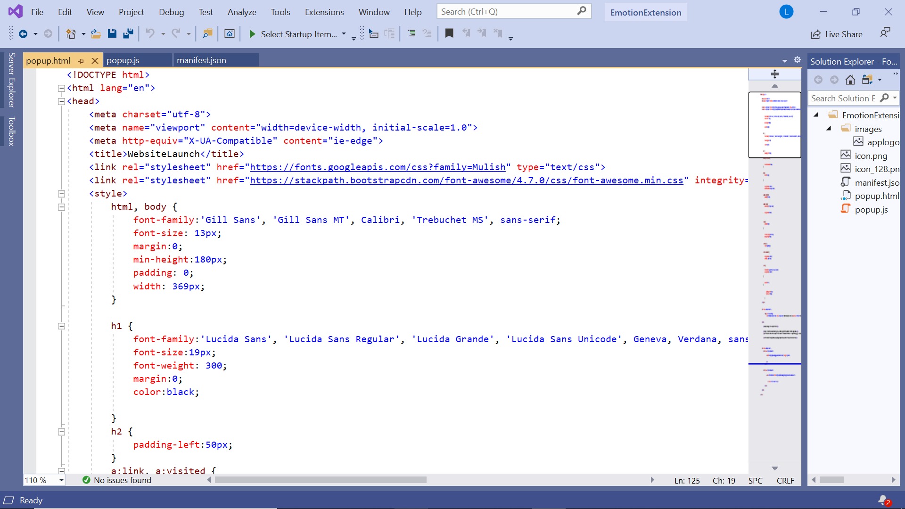

   You should see something like this!

3. Now, go back to the Chrome Extensions tab. In the left hand corner, there will be a button saying `Load Unpacked` . Click it, then select the Emotion Extension folder. 

   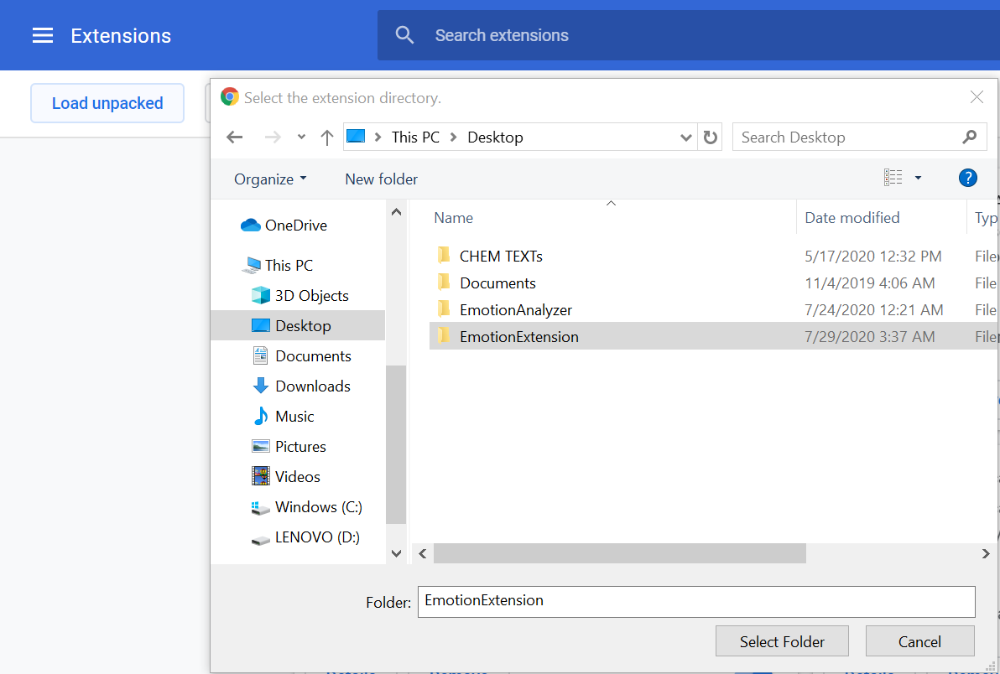

   Once selected, confirm and an extension should show up! Toggle it on. 

4. Now that the extension is unpacked to your Chrome browser, all you have left to do is customize it to work with the websites you made. In Visual Studio, click the HTML file, if you are not already on it. You only have to change 3 URLs to get the extension to work, buuut you can optionally change the styling in the first bit in the HTML file. That includes sizes of fonts, descriptions, coloring, etc. 

   

   Scroll past the styling if you don't want to change it until you get to the code line that says `
`. Below this, there are 3 clear hyperlinks. For the first one, put down the storage account URL to the actual blob container. For example, if your storage account was named myhomegarage, the URL would be https://myhomegarage.blob.core.windows.net/data/. Whatever it is, replace the original URL with the one for your storage account. Replace the 3rd URL too. 

   For the 2nd URL, replace it with your web app website from before. If you named the web app worldsbestapp, replace the original URL with https://worldsbestapp.azurewebsites.net. You get the gist. 

5. Once those 3 URLs are replaced, you're good! Simply left click and click on `View in Browser (Google Chrome)`.  This will update the Chrome extension with your new edits!

   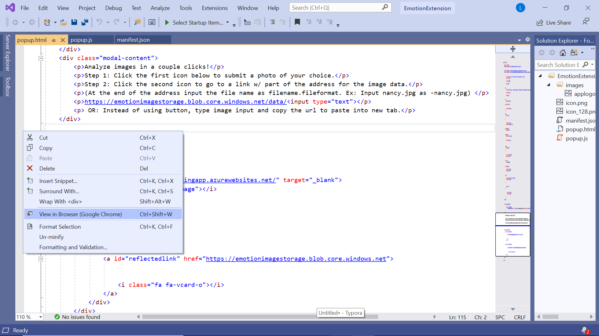

6. YOU'RE DONE! Now, when you click the little icon in the extensions menu on the top right of your Chrome Browser, a small menu page will show with links and instructions to analyze any photo. If you click the icons, they should take you to the Azure Websites you made and allow you to access the photo analysis information the Website garners. 

   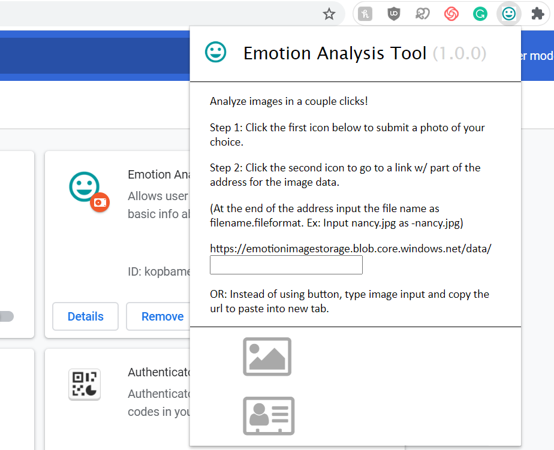

And that's it folks! In this tutorial, you learned how to make a Google Chrome extension that allows easy access to an Azure website to upload photos to receive basic, objective analysis on them. Great job! I'm proud of you! 

Happy coding! 

